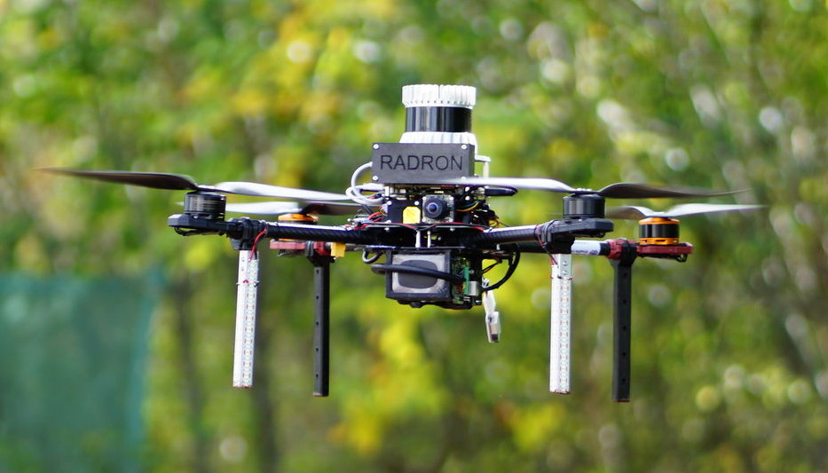
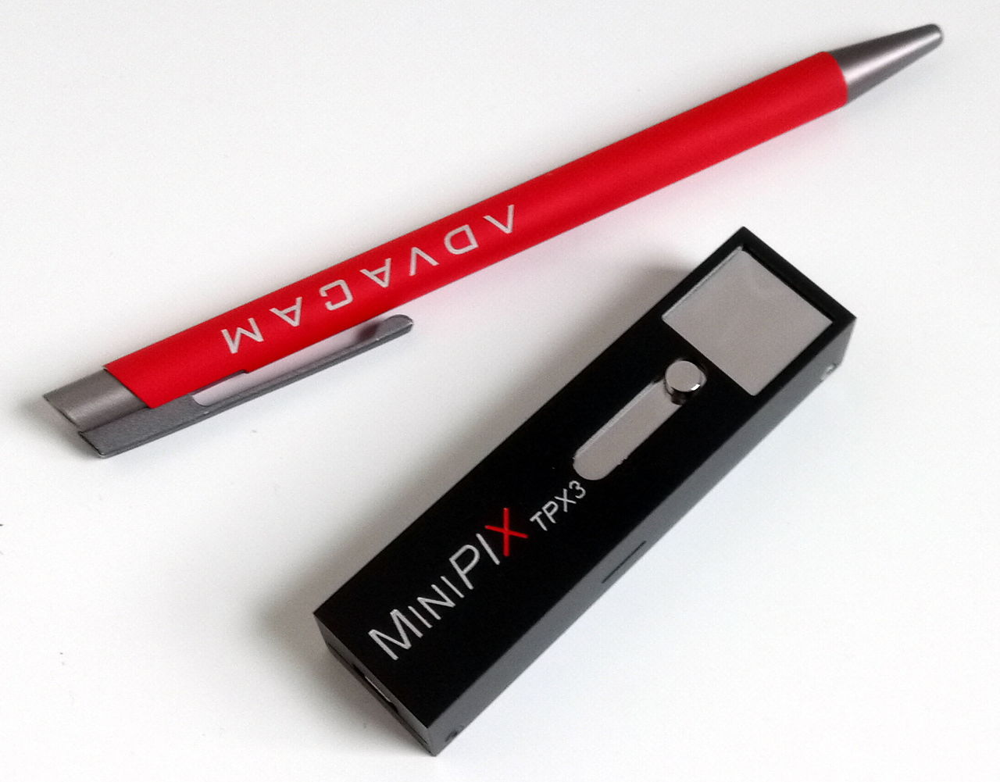

# Rospix3

| Build status | [](https://github.com/rospix/rospix3/actions) | [](https://github.com/rospix/rospix3/actions) |
|--------------|-----------------------------------------------------------------------------------------------------------------------------|----------------------------------------------------------------------------------------------------------------------------|

ROS driver for TPX3 event-camera devices on the Advacam hardware interface, most notably the MiniPIX TPX3 with a CdTe sensor used as a single-detector Compton camera.

<p align="center">
  
  
</p>

The driver reads out the continuous stream of hit pixels produced by the Timepix3 chip, clusters them into particle tracks (below), and publishes them as [`rad_msgs/ClusterList`](https://github.com/rospix/rad_msgs) messages for downstream processing.

<p align="center">
  
</p>

## System overview

Rospix3 is the lowest layer of a three-package pipeline for real-time gamma radiation source localization from a single-detector Compton camera:

1. **Rospix3** (this package) — drives the MiniPIX TPX3 detector and publishes the stream of detected particle clusters.
2. [**compton_cone_generator**](https://github.com/rospix/compton_cone_generator) — pairs coincident electron/photon clusters from Rospix3 and reconstructs the Compton cone of possible source directions for each event.
3. [**compton_camera_filter**](https://github.com/rospix/compton_camera_filter) — fuses the incoming stream of cones into a real-time full-state hypothesis of the radiation source position.

## How it works

The core is the `Rospix3` nodelet ([src/rospix3.cpp](./src/rospix3.cpp)). It is a thin ROS wrapper around the vendor **Pixet Core** SDK (`lib/x64/pxcore.so`) — it does not do any Compton-specific processing itself, it just turns the raw stream of detector hits into ROS messages.

* **Init** — loads parameters, dynamically loads `pxcore.so` (`pxpClLoadPixetCore`) and opens a handle to detector 0 (`pxpClCreate`). If `use_calibration` is set, it loads the per-pixel energy calibration (`a/b/c/t.txt`) into the SDK. It registers 5 callbacks with the SDK (message/progress/new-clusters/acquisition-start/acquisition-finished) and, if `save_raw_data` is set, creates a timestamped output directory for raw `.t3pa` dumps.
* **`timerMeasurement`** (`measurement_timer_rate`) — if the detector is idle and the dynamic-reconfigure flag `measuring` is true, starts a new acquisition window via `pxpClStartMeasurement(acquisition_duration, measurement_duration, ...)`, optionally streaming the raw pixel data straight to a `.t3pa` file on disk.
* **SDK callback `callbackTimepixNewClustersWithPixels`** — fires asynchronously from the SDK whenever it has clustered a batch of hit pixels into particle tracks. For every `PXPClusterWithPixels` it builds a `rad_msgs::Cluster` (energy, pixel size, roundness, centroid x/y, time-of-arrival) together with all of its individual hit pixels, and pushes it onto an internal queue guarded by `mutex_cluster_list_`.
* **`callbackTimepixAcquisitionFinished`** — bookkeeping for each finished acquisition; if `noisy_pixel_masking` is enabled, triggers `pxpClMaskNoisyPixels` to blacklist hot pixels found during that acquisition.
* **`timerPublisher`** (`publisher_timer_rate`) — independently drains the internal queue and publishes everything accumulated since the last tick as one `rad_msgs/ClusterList` on `cluster_list_out`.

[src/rospix3multisensor.cpp](./src/rospix3multisensor.cpp) provides a second nodelet, `Rospix3Multisensor`, with the exact same logic duplicated for two hardcoded detector handles, each publishing to its own `<sensor_alias>/cluster_list` topic — for setups with two TPX3 devices on one host.

## Compatibility

ROS Melodic / Noetic

## Dependencies

ROS, catkin-tools, and other dependencies required for compiling Rospix3 with its other dependencies:
```bash
./installation/install_dependencies.sh
```

Clone the following packages into your workspace and compile together with **Rospix3**.

* [mrs_lib](https://github.com/ctu-mrs/mrs_lib)
  * [mrs_msgs](https://github.com/ctu-mrs/mrs_msgs)
* [rad_msgs](https://github.com/rospix/rad_msgs)

## Citing this work

If you use this package in your research, please cite the following papers:

```bibtex
@inproceedings{baca2019timepix,
  author    = {Baca, Tomas and Jilek, Martin and Manek, Pavel and others},
  title     = {{Timepix Radiation Detector for Autonomous Radiation Localization and Mapping by Micro Unmanned Vehicles}},
  booktitle = {2019 IEEE/RSJ International Conference on Intelligent Robots and Systems (IROS)},
  year      = {2019},
  publisher = {IEEE},
  pages     = {1--8},
}

@inproceedings{baca2021gamma,
  author    = {Baca, Tomas and Stibinger, Petr and Doubravova, Daniela and Turecek, Daniel and Solc, Jaroslav and Rusnak, Jan and Saska, Martin and Jakubek, Jan},
  title     = {{Gamma Radiation Source Localization for Micro Aerial Vehicles with a Miniature Single-Detector Compton Event Camera}},
  booktitle = {2021 International Conference on Unmanned Aircraft Systems (ICUAS)},
  year      = {2021},
  publisher = {IEEE},
}

@article{stibinger2020localization,
  author  = {Stibinger, Petr and Baca, Tomas and Saska, Martin},
  title   = {{Localization of Ionizing Radiation Sources by Cooperating Micro Aerial Vehicles With Pixel Detectors in Real-Time}},
  journal = {IEEE Robotics and Automation Letters},
  volume  = {5},
  number  = {2},
  pages   = {3634--3641},
  year    = {2020},
  doi     = {10.1109/LRA.2020.2978456},
}
```
